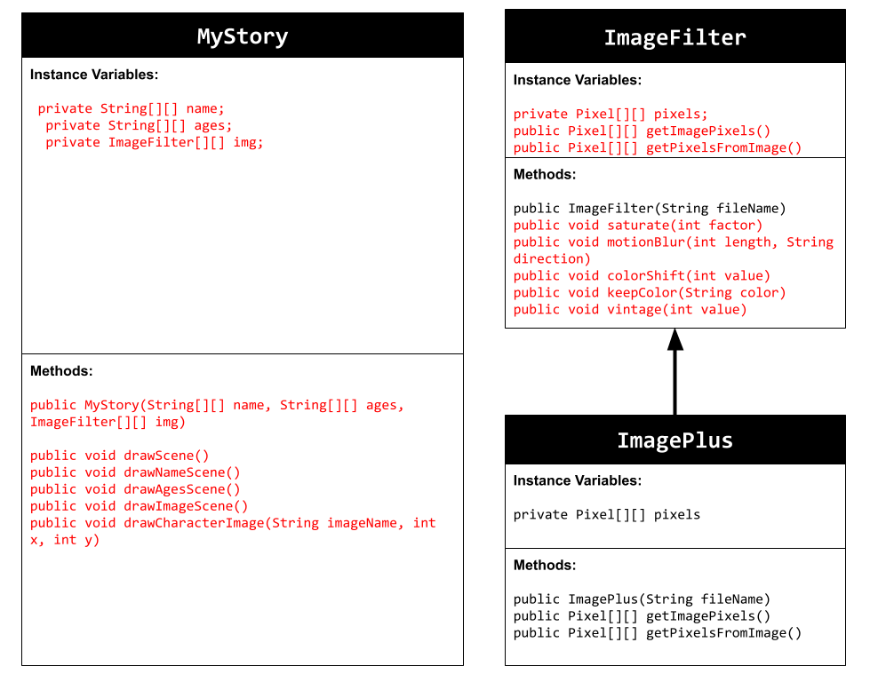
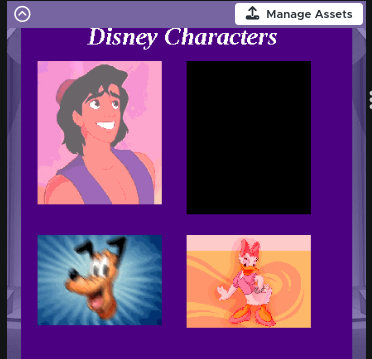

# Unit 4 - Personal Narrative

## Introduction

Images are often used to portray our personal experiences and interests. We also use image filters and effects to change or enhance the mood of an image. When combined into collages and presentations, these images tell a story about who we are and what is important to us. Your goal is to create a personal narrative using The Theater that consists of images of your personal experiences and/or interests, incorporates data related to these experiences and/or interests that can be organized in a 2D array, and uses image filters and effects to change or enhance the mood of your images.

## Requirements

Use your knowledge of object-oriented programming, two-dimensional (2D) arrays, and algorithms to create your personal narrative collage or animation:

- **Create at least two 2D arrays** – Create at least two 2D arrays to store the data that will make up your visualization.
- **Implement one or more algorithms** – Implement one or more algorithms that use loops and two-way or multi-selection statements with compound Boolean expressions to analyze the data.
- **Use Image Filters** - Include multiple image filters learned from this unit, and additionally create new ones of your own.
- **Use methods in the String class** – Use one or more methods in the String class in your program, such as to determine whether the name of an image file contains specific characters.
- **Create a visualization** – Create an image or animation that conveys the story of the data by illustrating the patterns or relationships in the data.
- **Document your code** – Use comments to explain the purpose of the methods and code segments and note any preconditions and postconditions.

## UML Diagram

Put and image of your UML Diagram here. Upload the image of your UML Diagram to your repository, then use the Markdown syntax to insert your image here. Make sure your image file name is one work, otherwise it might not properly get display on this README.

## Video

Record a short video of your story to display here on your README. You can do this by:

- Screen record your project running on Code.org.
- Upload that recording to YouTube.
- Take a thumbnail for your image.
- Upload the thumbnail image to your repo.
- Use the following markdown

## Story Description

My story is supposed to showcase my favorite Disney characters in categories of male, female, animal male, and animal female. My whole life I grew up watching Disney and going to Disneyland. I wanted to create something relating to Disney and show filters that I can apply to these images. Data that is represented in my 2D arrays are the character names commonly reffered by, how old their first movie/apperance of them since they came out. These directly relate to my animation showcase to show their names and how old they are to show the impact these movies still have to me today and their characters.
## Image Filter Analysis

One of the filters that I used in my animation that I had created for class was my color shift filter. This filter sets the value of red, green, and blue to 255. When assigning it to an image like aladdin.colorShift, in the parantheses you can add the amount of how much you want the color to shift to, the more you shift the more it changes. If the value goes over 255 which is the max it will be reset to 255 and variables such as newGreen and such, add the current pixel with the value of each color. For my own filter, I wanted to make a vintage look so I decided to increase the red values to make the image more a red hue while decreasing the other two values by their max as well as dividing it by 2. The current pixel is then called to show the filters and values on the animation of the new red green and blue values. 